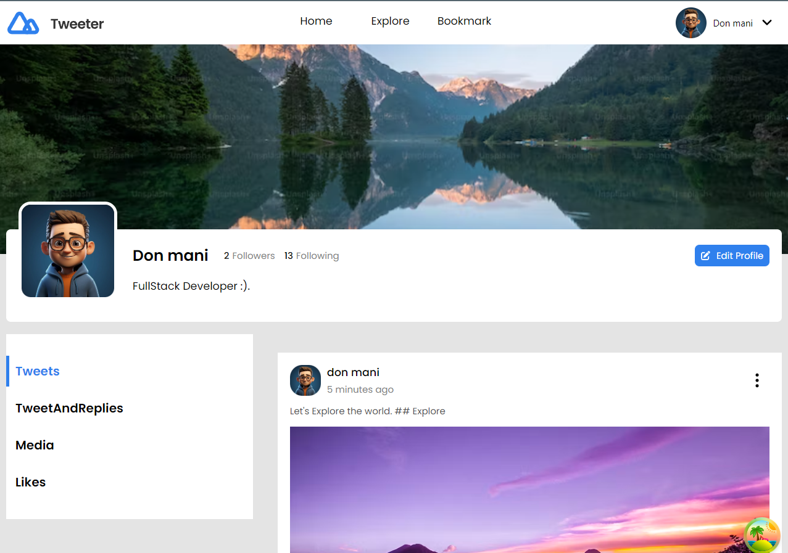

<h1 align="center">Tweeter - Twitter Clone</h1>

<div align="center">
   Solution for a challenge from  <a href="http://devchallenges.io" target="_blank">Devchallenges.io</a>.
</div>

<div align="center">
  <h3>
    <a href="https://tweeter-fronend.onrender.com/" target="_blank">
      Demo
    </a>
    <span> | </span>
    <a href="" target="_blank">
      Solution
    </a>
    <span> | </span>
    <a href="https://legacy.devchallenges.io/challenges/rleoQc34THclWx1cFFKH" target="_blank">
      Challenge
    </a>
  </h3>
</div>

<!-- TABLE OF CONTENTS -->

## Table of Contents

-   [Overview](#overview)
-   [Installation](#installation)
-   [Built With](#built-with)
-   [Features](#features)
-   [Acknowledgements](#acknowledgements)

<!-- OVERVIEW -->

## Overview



#### Installation:

1.  Clone the repository:

    ```bash
    git clone https://github.com/render217/tweeterv1
    ```

2.  Create a .env file in backend/config folder and add the following as key = value

          ```
            JWT_EXPIRES_IN=
            JWT_SECRET=
            MONGODB_URI=
            DB_NAME=
            NODE_ENV=
            PORT=

            CLOUDINARY_CLOUD_NAME=
            CLOUDINARY_API_SECRET=
            CLOUDINARY_API_KEY=
          ```

    Create a .env file in frontend directory and add the following as key = value

    ```
      VITE_BACKEND_URL = localhost:PORT/api/v1/images

      N.B(PORT => port you used for the backend)
    ```

3.  Navigate into the directory and install dependencies: both in frontend and backend folder

    ```bash
    npm install
    ```

4.  Start the development server: in both client and backend folder
    ```bash
    npm run dev
    ```

### Built With

<!-- This section should list any major frameworks that you built your project using. Here are a few examples.-->

-   **React**
-   **React Query**
-   **Tailwind**
-   **Express**
-   **MongoDB**

## Features

<!-- List the features of your application or follow the template. Don't share the figma file here :) -->

This application/site was created as a submission to a [DevChallenges](https://legacy.devchallenges.io/challenges/rleoQc34THclWx1cFFKH) challenge. The [challenge](https://legacy.devchallenges.io/challenges/rleoQc34THclWx1cFFKH) was to build an application to complete the given user stories.

-   User story: I can see my profile or others' profile
-   User story: When I am on a profile, I can see Tweets and Retweets. I can also filter by Tweets, Tweets and replies, Media and Likes
-   User story: When I am on a profile, I can see followers and following
-   User story: When I am on a profile, I can see follow or unfollow the user
-   User story: I can navigate between Home, Explore and Bookmarks
-   User story: I can navigate to My Profile, Group Chat (optional), Setting/Authentication App.
-   User story: When I am on Home, I can post a new Tweet
-   User story: When I post a new Tweet, I can choose to upload an image and set the Tweet to be public or only-follower
-   User story: When I am on Home, I can see Tweets of people who I follow
-   User story: I can Comment, Retweet, Like or Save a Tweet
-   User story: I can Comment with image and I can like a comment
-   User story: I can see the posted time of the Comments and Tweets
-   User story: When I am on Home, I can see the most popular hashtags and people I should follow (it's up to you how to implement this)
-   User story: When I am on Explore, I can see the Top, Latest Tweet, or Tweet with Media. I can also choose to see the most popular people
-   User story: When I am on Bookmarks, I can see the Saved Tweet
-   User story(optional): I can search for a group

## Acknowledgements

-   [Render](https://render.com) - For Both Frontend and backend deployment
-   [fontawesome](https://fontawesome.com)
-   [Cloudinary](https://cloudinary.com) - For Image Upload
